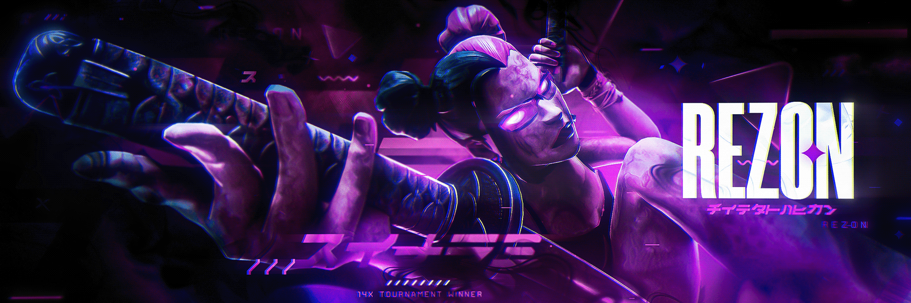

<h1 align="center">Rezon - Automated Bug Hunting Recon Tool</h1>

<p align="center">
  
  
  
  <br>
  
  
  <br>
  
  
  
  
</p>





## 🎯 Overview

BantuHunters is a comprehensive, automated bug hunting and vulnerability assessment platform that integrates multiple security testing tools into a unified, web-based interface. Built for security researchers, penetration testers, and bug bounty hunters, it provides real-time scanning capabilities with intelligent analysis and reporting.


## 🏗️ Architecture

```mermaid
graph TB
    A[Web Interface] --> B[FastAPI Backend]
    B --> C[Scan Engine]
    C --> D[SQLMap Scanner]
    C --> E[Subdominator Scanner]
    C --> F[Nmap Scanner]
    C --> G[Nuclei Scanner]
    C --> H[Waybackurls Scanner]
    B --> I[PostgreSQL Database]
    B --> J[Redis Cache]
    B --> K[WebSocket Manager]
    K --> A
    
    style A fill:#e1f5fe
    style B fill:#f3e5f5
    style C fill:#fff3e0
    style I fill:#e8f5e8
    style J fill:#ffebee


